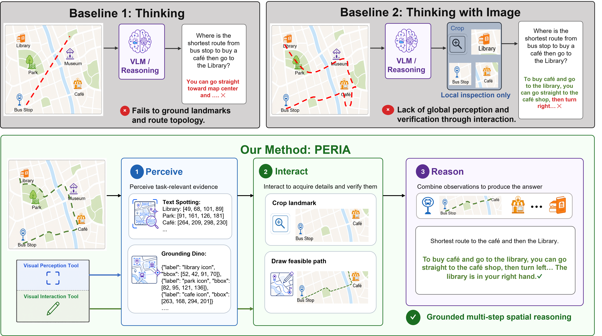
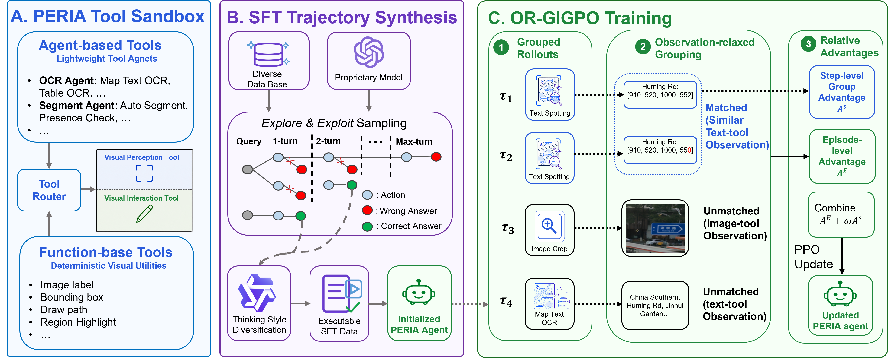
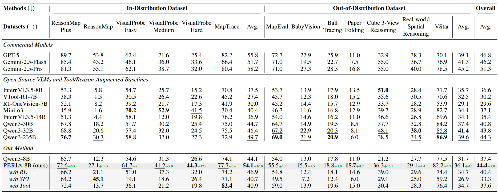

<h1 align="center"> PERIA: Perceive, Interact, Reason — Building Tool-Augmented Visual Agents for Spatial Reasoning </h1>

This repository releases the official implementation of **PERIA: Perceive, Interact, Reason — Building Tool-Augmented Visual Agents for Spatial Reasoning**.

PERIA is a tool-augmented visual agent for spatial reasoning. It builds on a Qwen3-VL backbone and learns to actively call perception and interaction tools to acquire fine-grained spatial evidence before answering.

Model checkpoints are hosted at [Antoinegg1/pedia_model](https://huggingface.co/Antoinegg1/pedia_model), and data is hosted at [Antoinegg1/pedia_data](https://huggingface.co/datasets/Antoinegg1/pedia_data).

## Abstract

Recent vision-language models (VLMs) show strong multimodal understanding, but they remain limited on spatial reasoning tasks that require active evidence acquisition and multi-step visual interaction. Relying only on implicit visual representations from vision encoders is often insufficient for recovering fine-grained spatial evidence. We introduce **PERIA**, a tool-augmented visual agent for spatial reasoning across map reasoning, visual probing, and vision reconstruction tasks.

PERIA uses two lightweight tool families: **vision perception tools** expose textual, symbolic, and spatial evidence, while **vision interaction tools** manipulate visual context, trace paths, and verify spatial relations. To train PERIA, we combine supervised tool-use trajectory synthesis, composite rewards, and **Observation-Relaxed Group-in-Group Policy Optimization (OR-GIGPO)** for effective multi-tool behavior. Across 13 benchmarks from 8 datasets, PERIA-8B improves over the Qwen3-8B backbone by **10.0% on in-distribution benchmarks and 4.4% on out-of-distribution benchmarks**, while outperforming previous state-of-the-art baselines of similar size by **7.0%-14.8%**. It also achieves performance comparable to much larger models such as Qwen3-VL-235B-A22B-Thinking and GPT-5, demonstrating the effectiveness of PERIA in enhancing spatial reasoning capabilities.

### Table of Contents  <!-- omit in toc -->

- [Abstract](#abstract)
- [PERIA: Perceive, Interact, Reason for Spatial Reasoning](#peria-perceive-interact-reason-for-spatial-reasoning)
  - [Motivation of the PERIA method](#motivation-of-the-peria-method)
  - [Tool-augmented reasoning](#tool-augmented-reasoning)
  - [Results summary](#results-summary)
- [Installation](#installation)
- [Evaluation](#evaluation)
  - [Env setup](#env-setup)
  - [Run inference](#run-inference)
  - [Score outputs](#score-outputs)
- [Dataset and Models](#dataset-and-models)
- [SFT Training](#sft-training)
  - [Env setup](#env-setup-1)
- [RL Training](#rl-training)
  - [Node A: tool server](#node-a-tool-server)
  - [Node B: RL training](#node-b-rl-training)
- [SFT Data Synthesis](#sft-data-synthesis)
- [Citation](#citation)
- [Acknowledgment](#acknowledgment)

## PERIA: Perceive, Interact, Reason for Spatial Reasoning

### Motivation of the PERIA method



Spatial reasoning often requires details that are easy to miss in a single forward pass: small text, map symbols, relative positions, object boundaries, and multi-step path constraints. PERIA treats these details as evidence to be acquired. Instead of relying only on the VLM's latent image representation, it lets the model call tools, observe their outputs, and refine its reasoning.

### Tool-augmented reasoning



PERIA organizes tools into two families:

- **Perception tools**: OCR, grounding, segmentation, and function tools that expose explicit textual, symbolic, and spatial evidence.
- **Interaction tools**: crop, label, draw, path tracing, highlighting, and bbox operations that let the agent manipulate visual context and verify spatial relations.


### Results summary



PERIA-8B targets spatial reasoning workloads including visual probing, map reasoning, path tracing, and out-of-distribution visual reasoning. In our experiments, it improves the Qwen3-VL-8B backbone and remains competitive with much larger models such as Qwen3-VL-235B-A22B-Thinking and GPT-5 on spatial reasoning benchmarks.

## Installation

Clone the repository:

```bash
git clone https://github.com/antoinegg1/PEDIA.git
cd PEDIA
```

This repo has three mutually incompatible environments because SFT, RL, and tool serving require different `torch`, `vllm`, and `transformers` versions. Each workflow below includes the environment setup it needs.

## Evaluation

We use `PEDIA_8B_v1` model and `visual_probe_easy` dataset as the running example in this section. More models and datasets are listed in [Dataset and Models](#dataset-and-models).

### Env setup

```bash
conda create -n peria-inference python=3.11 -y
conda activate peria-inference
pip install -U -r geo_edit/requirements.txt -e ./geo_edit
```

Download PERIA-8B, the tool backends, and extract the ID evaluation tarball:

```bash
# PERIA-8B checkpoint + tool backends
hf download Antoinegg1/pedia_model \
    --include "PEDIA_8B_v1/*" "PaddleOCR-VL-1.5/*" "sam3.1/*" "grounding-dino-base/*" \
    --local-dir ./pedia_model

# ID evaluation benchmarks, including visual_probe_easy
hf download Antoinegg1/pedia_data --repo-type dataset \
    --include "eval/id_data.tar" \
    --local-dir ./pedia_data

tar -xf ./pedia_data/eval/id_data.tar -C ./pedia_data/eval
```

### Run inference

```bash
DATASET=visual_probe_easy bash geo_edit/scripts/run_inference.sh
```

The script defaults to tool actors on GPUs `0,1,2,3` and vLLM `DP_SIZE=4` on GPUs `4,5,6,7`. To evaluate another registered dataset, extract the corresponding eval tarball and run with `DATASET=<dataset_id>`.

### Score outputs

Use the same `peria-inference` environment from the inference step:

```bash
DATASET=visual_probe_easy bash geo_edit/scripts/run_eval.sh
```

Raw inference outputs are saved under `./outputs/eval_results/visual_probe_easy/PEDIA_8B_v1/`, and scored summaries are saved under `./outputs/eval_output/visual_probe_easy/PEDIA_8B_v1/`.

By default, `run_eval.sh` uses rule-based scoring only. To reproduce paper numbers, enable the LLM-judge fallback with `export JUDGE_API_KEY=<your-openai-key>`.

## Dataset and Models

All released checkpoints live in [Antoinegg1/pedia_model](https://huggingface.co/Antoinegg1/pedia_model):

| Path | Purpose |
|---|---|
| `PEDIA_8B_v1/` | Default 8B RL checkpoint  |
| `pedia_8b_SFT_v1/` | 8B SFT checkpoint used as the RL starting point |
| `pedia_4b_v1/` | Optional 4B RL checkpoint |
| `pedia_2b_v1/` | Optional 2B RL checkpoint |
| `PaddleOCR-VL-1.5/` | OCR and document perception tool backend |
| `sam3.1/` | Segmentation tool backend |
| `grounding-dino-base/` | Grounding tool backend |

All released data lives in [Antoinegg1/pedia_data](https://huggingface.co/datasets/Antoinegg1/pedia_data):

| Path | Purpose |
|---|---|
| `pedia_sft_v1.tar` | SFT data archive: `train.json` and images |
| `pedia_rl_v1.tar` | RL train and validation parquet files plus images |
| `eval/id_data.tar` | In-distribution evaluation benchmarks |
| `eval/ood_data.tar` | Out-of-distribution evaluation benchmarks |

## SFT Training

SFT trains from the public Qwen3-VL-8B-Thinking base model on `pedia_sft_v1`.

### Env setup

```bash
conda create -n peria-sft python=3.11 -y
conda activate peria-sft
pip install -r llamafactory/requirements.txt
```

Download the base VLM and SFT data:

```bash
hf download Qwen/Qwen3-VL-8B-Thinking \
    --local-dir ./pedia_model/Qwen3-VL-8B-Thinking

hf download Antoinegg1/pedia_data --repo-type dataset \
    --include "pedia_sft_v1.tar" \
    --local-dir ./pedia_data

tar -xf ./pedia_data/pedia_sft_v1.tar -C ./pedia_data
```

Run SFT on one 8-GPU node:

```bash
bash llamafactory/train_v1.sh
```

The checkpoint is written to `./pedia_model/pedia_8b_SFT_v1/`. SFT configuration lives in [`llamafactory/configs/pedia_sft_v1.yaml`](llamafactory/configs/pedia_sft_v1.yaml), and the launcher is [`llamafactory/train_v1.sh`](llamafactory/train_v1.sh).

## RL Training

RL fine-tunes the SFT checkpoint with OR-GIGPO against the HTTP tool server. Use two 8-GPU nodes by default: Node A runs the tool server with `peria-tools`, and Node B runs RL with `peria-rl`. After starting the tool server on Node A, use `hostname -i` to get the IP address for `TOOL_SERVER_IP` on Node B.

### Node A: tool server

Set up the tool-server environment, download the tool backends, and start the HTTP router:

```bash
conda create -n peria-tools python=3.11 -y
conda activate peria-tools
cd train_tool_server && pip install -r requirements.txt && cd ..

hf download Antoinegg1/pedia_model \
    --include "PaddleOCR-VL-1.5/*" "sam3.1/*" "grounding-dino-base/*" \
    --local-dir ./pedia_model

bash train_tool_server/scripts/launch_tool_server.sh
```

In another shell on Node A, get the IP address:

```bash
hostname -i
```

The RL launcher builds the endpoint as `http://<node-a-ip>:30888/get_observation`.

### Node B: RL training

Node B needs a fresh `peria-rl` environment with its own `verl-tool/requirements.txt`; do not reuse the Node A `peria-tools` environment. Set up the RL environment, download the SFT checkpoint and RL data, then point `TOOL_SERVER_IP` to Node A:

```bash
conda create -n peria-rl python=3.11 -y
conda activate peria-rl
unset ROCR_VISIBLE_DEVICES
cd verl-tool
TORCH_CUDA_ARCH_LIST="8.9" MAX_JOBS=48 NVCC_THREADS=4 \
    pip install -r requirements.txt
cd ..

hf download Antoinegg1/pedia_model \
    --include "pedia_8b_SFT_v1/*" \
    --local-dir ./pedia_model

hf download Antoinegg1/pedia_data --repo-type dataset \
    --include "pedia_rl_v1.tar" \
    --local-dir ./pedia_data

tar -xf ./pedia_data/pedia_rl_v1.tar -C ./pedia_data

TOOL_SERVER_IP=<node-a-ip> \
    bash verl-tool/examples/train/geo_edit/run_pedia_rl_v1_singlenode.sh
```

RL outputs are saved under `./outputs/mixed_rl/`. For 4-node training, use [`verl-tool/examples/train/geo_edit/run_pedia_rl_v1_multinode.sh`](verl-tool/examples/train/geo_edit/run_pedia_rl_v1_multinode.sh) with the Ray startup scripts in the same directory.

## SFT Data Synthesis

SFT data synthesis uses the same `peria-inference` environment as [Evaluation](#evaluation). The example below synthesizes trajectories from [FSCCS/ReasonMap-Plus](https://huggingface.co/datasets/FSCCS/ReasonMap-Plus) and converts them to LLaMA-Factory SFT format.

```bash
conda create -n peria-inference python=3.11 -y
conda activate peria-inference
pip install -U -r geo_edit/requirements.txt -e ./geo_edit
```

Download the public Qwen base model, PERIA tool backends, and ReasonMap-Plus:

```bash
hf download Qwen/Qwen3-VL-8B-Thinking \
    --local-dir ./pedia_model/Qwen3-VL-8B-Thinking

hf download Antoinegg1/pedia_model \
    --include "PaddleOCR-VL-1.5/*" "sam3.1/*" "grounding-dino-base/*" \
    --local-dir ./pedia_model

hf download FSCCS/ReasonMap-Plus --repo-type dataset \
    --local-dir ./pedia_data/raw/reasonmap_plus
```

Run the synthesis pipeline. The script reads `./pedia_data/raw/reasonmap_plus/train.parquet`, starts local Ray tool actors and vLLM, then runs trajectory sampling, filtering/diversification, and SFT conversion.

```bash
export JUDGE_API_KEY=<your-openai-key>
bash geo_edit/scripts/run_sft_data_synthesis.sh
```

The generated SFT data is written to `./pedia_data/pedia_sft_v1/`. Override `SAMPLE_RATE`, `DATASET_SPLIT`, `TRAJ_DIR`, or `SFT_OUT_DIR` if you want a smaller run or a different output location.

## Citation

```bibtex
@article{peria2026,
    author  = {<TODO authors>},
    title   = {Perceive, Interact, Reason: Building Tool-Augmented Visual Agents for Spatial Reasoning},
    journal = {arXiv},
    year    = {2026}
}
```

## Acknowledgment

This repository benefits from [Qwen3-VL](https://github.com/QwenLM/Qwen3-VL), [AReaL](https://github.com/inclusionAI/AReaL), [verl](https://github.com/volcengine/verl), [verl-tool](https://github.com/volcengine/verl), [LLaMA-Factory](https://github.com/hiyouga/LLaMA-Factory), [PaddleOCR](https://github.com/PaddlePaddle/PaddleOCR), [SAM](https://github.com/facebookresearch/sam2), and [Grounding-DINO](https://github.com/IDEA-Research/GroundingDINO).

Thanks to the authors for releasing these codebases.
